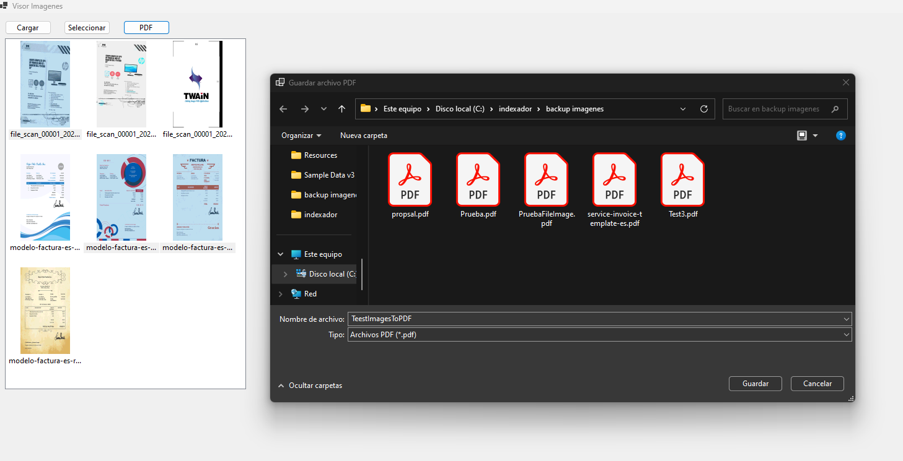

# WinAppImageViewListToPDF
This is a windows application to show images in a multiselection listView and you can save then in a PDF file 

## Platform

C# Net Core 8

## Images

1. First you have to search the images which you want to see in the listView. Clic on Cargar (load) button. 

2. You can select one or more images.

3. You can save then in any folder. Clic on PDF button.

